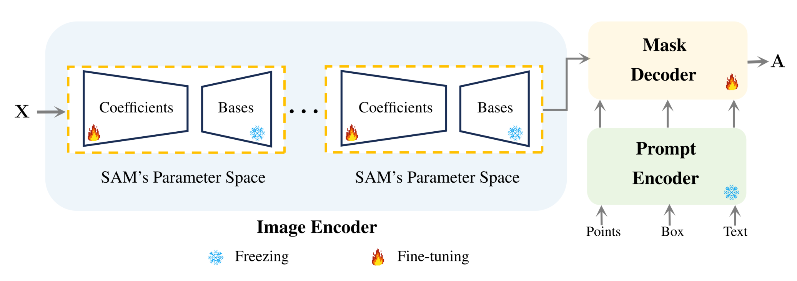

# SAM-PARSER
The official implementation of AAAI 2024 paper:"SAM-PARSER: Fine-tuning SAM Efficiently by Parameter Space Reconstruction" If this project is helpful to your research, please consider citing our paper [PDF](https://arxiv.org/abs/2308.14604).
```
@inproceedings{peng2024sam,
  title={Sam-parser: Fine-tuning sam efficiently by parameter space reconstruction},
  author={Peng, Zelin and Xu, Zhengqin and Zeng, Zhilin and Yang, Xiaokang and Shen, Wei},
  booktitle={Proceedings of the AAAI Conference on Artificial Intelligence},
  volume={38},
  number={5},
  pages={4515--4523},
  year={2024}
}
```
# Method


